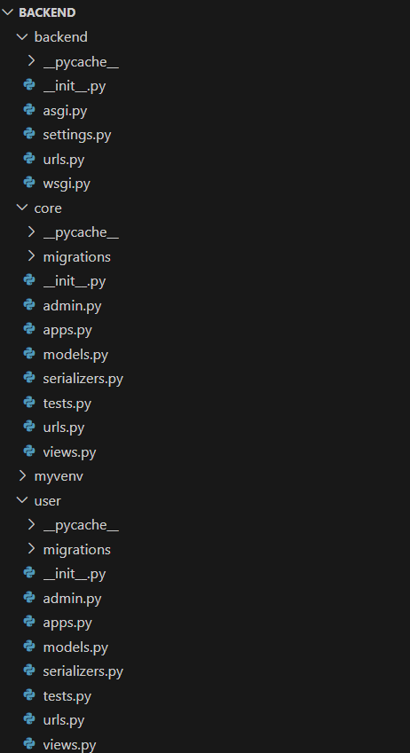
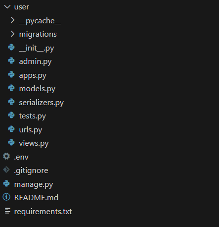

# 🏥 Healthcare Backend API

This project is a secure backend system for a healthcare application, built using Django, Django REST Framework (DRF), and PostgreSQL. It provides authentication, patient/doctor record management, and doctor-patient assignment functionalities via RESTful APIs.

---

## 🚀 Features

- ✅ User registration and login with JWT authentication
- 👤 Manage Patient and Doctor records (CRUD)
- 🔗 Assign doctors to patients
- 🔐 Secure API access for authenticated users only
- 🗃️ PostgreSQL as database
- ⚙️ Clean code using Django ORM and DRF generics
- 📁 Environment variable support using `.env`

---

## 📦 Technologies Used

- Python 3.x
- Django 4.x
- Django REST Framework
- PostgreSQL
- Simple JWT (`djangorestframework-simplejwt`)
- dotenv (`python-dotenv`)

---

## 📁 Project Structure





---

## 🔐 Authentication APIs

| Method | Endpoint               | Description            |
|--------|------------------------|------------------------|
| POST   | `/api/auth/register/`  | Register a new user    |
| POST   | `/api/auth/login/`     | Obtain JWT token       |
| POST   | `/api/auth/token/refresh/` | Refresh JWT token  |

---

## 🧑‍⚕️ Patient Management APIs

| Method | Endpoint               | Description                          |
|--------|------------------------|--------------------------------------|
| POST   | `/api/patients/`       | Add new patient (auth required)      |
| GET    | `/api/patients/`       | List patients added by current user  |
| GET    | `/api/patients/<id>/`  | Get patient details by ID            |
| PUT    | `/api/patients/<id>/`  | Update patient info                  |
| DELETE | `/api/patients/<id>/`  | Delete patient record                |

---

## 👨‍⚕️ Doctor Management APIs

| Method | Endpoint               | Description           |
|--------|------------------------|-----------------------|
| POST   | `/api/doctors/`        | Add new doctor        |
| GET    | `/api/doctors/`        | List all doctors      |
| GET    | `/api/doctors/<id>/`   | Get doctor details    |
| PUT    | `/api/doctors/<id>/`   | Update doctor info    |
| DELETE | `/api/doctors/<id>/`   | Delete doctor record  |

---

## 🔁 Patient-Doctor Mapping APIs

| Method | Endpoint                     | Description                        |
|--------|------------------------------|------------------------------------|
| POST   | `/api/mappings/`             | Assign a doctor to a patient       |
| GET    | `/api/mappings/`             | Get all patient-doctor mappings    |
| GET    | `/api/mappings/<patient_id>/`| Get mappings for specific patient  |
| DELETE | `/api/mappings/<id>/`        | Remove doctor-patient mapping      |

---

## ⚙️ Setup Instructions

### 1. Clone the Repository

```bash
git clone https://github.com/your-username/healthcare-backend.git
cd healthcare-backend
```
### 2. Create .env File

```bash
SECRET_KEY=your-django-secret-key
DB_NAME=your_db
DB_USER=your_user
DB_PASSWORD=your_password
DB_HOST=localhost
DB_PORT=5432
```

### 3. Create Virtual Environment

```bash
python -m venv venv
source venv/bin/activate
```

### 4. Install Dependencies

```bash
pip install -r requirements.txt
```

### 5. Run Migrations & Start Server

```bash
python manage.py migrate
python manage.py runserver
```

### 6. Test APIs


- Thunder Client (VS Code)
- Postman